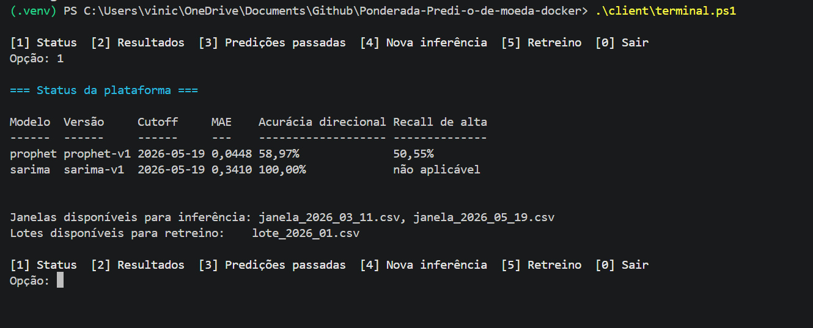
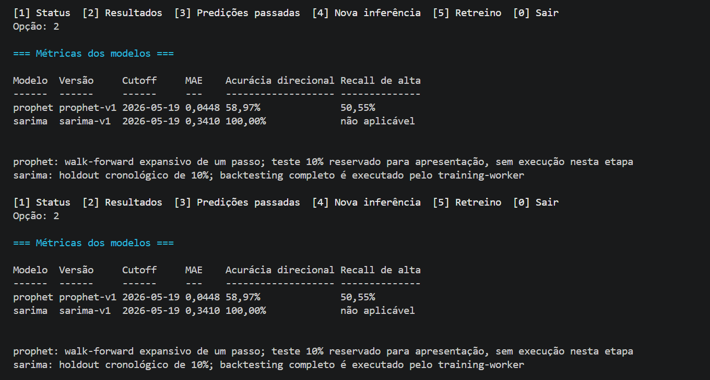
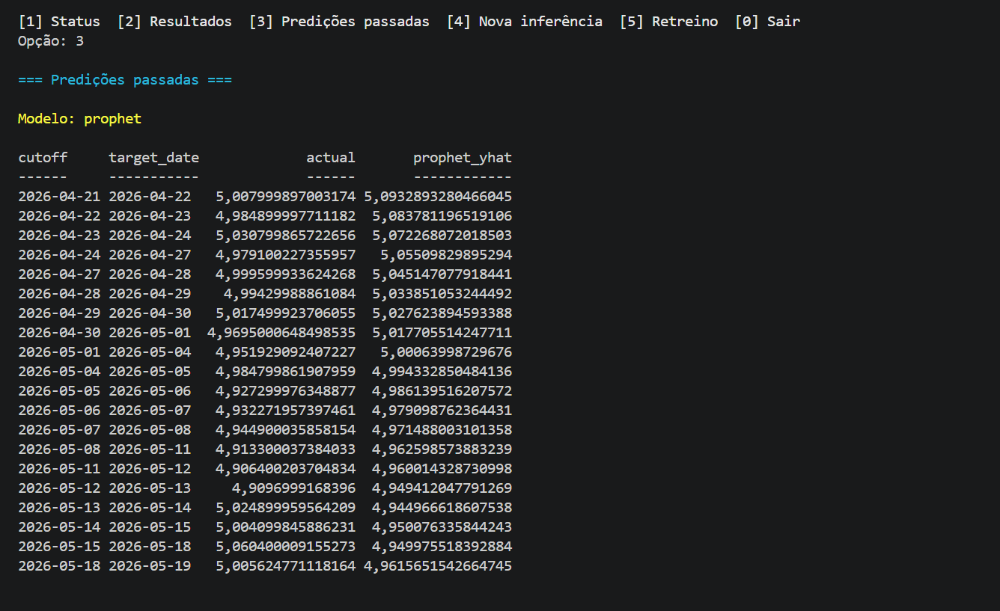
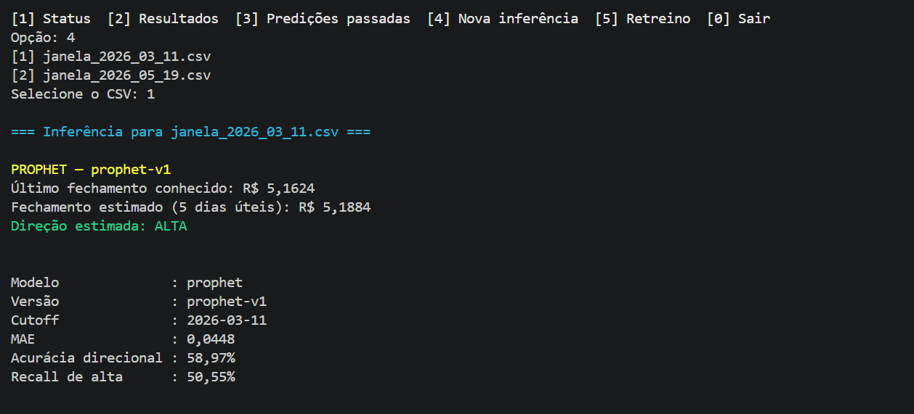
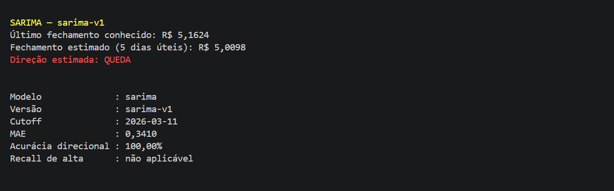
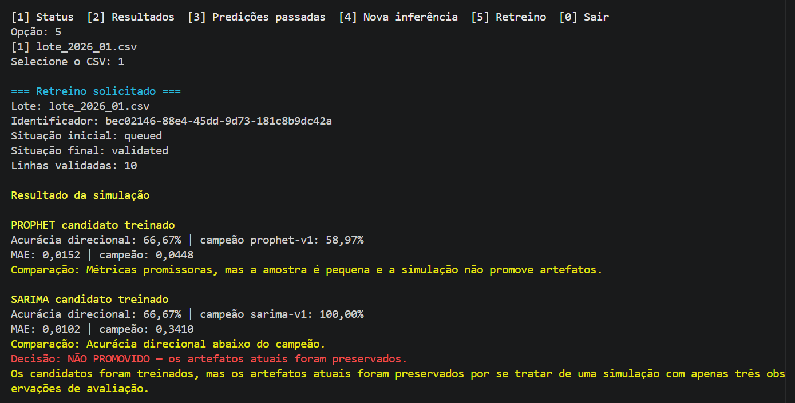

# Plataforma USD/BRL — Prophet e SARIMA

**Vinícius Rangel Marques dos Santos — T16**

Projeto acadêmico de previsão experimental de USD/BRL. Não produz recomendação financeira.

## Arquitetura e pastas

Cada serviço do Compose tem Dockerfile próprio em `src/`: `backend` (API FastAPI), `models/prophet`, `models/sarima`, `mlops` (validação e preparação), `training` (fila de retreino), `bronze` (MinIO) e `postgres` (metadados Silver/Gold). A rede `usdbrl_internal` conecta os serviços; somente o `backend-api` publica a porta `8080`.

`data/raw/usd_brl_daily.csv` é o snapshot imutável. `data/dataRetreino/` contém lotes selecionáveis para retreino e `data/dataInferencia/` contém janelas cronológicas progressivas para simulação de inferência. `artifacts/` contém o artefato Prophet e suas métricas.

## Modelos e avaliação

O Prophet é o baseline existente. O SARIMA é treinado pelo serviço próprio usando uma divisão cronológica; o training-worker é responsável pelo backtesting completo e pela promoção. As métricas retornadas pela API são MAE, acurácia direcional e recall da classe `alta`. Persistência do último fechamento é o baseline de comparação. Nunca há embaralhamento temporal.

## Como executar e usar

1. Abra o PowerShell na raiz do projeto.

2. Caso o PowerShell bloqueie a execução local de scripts, libere-a somente para a sessão atual:

```powershell
Set-ExecutionPolicy -Scope Process -ExecutionPolicy RemoteSigned
```

3. Inicie os containers e aguarde a conclusão do build:

```powershell
docker compose up --build -d
```

4. Confirme que a API está saudável:

```powershell
curl.exe http://localhost:8080/health
```

5. Consulte a ajuda do cliente e abra o menu:

```powershell
.\client\terminal.ps1 -Help
.\client\terminal.ps1
```

6. No menu, escolha uma operação:

- `1` mostra versão, cutoff, métricas e CSVs disponíveis;
- `2` mostra as métricas de Prophet e SARIMA;
- `3` apresenta as predições históricas publicadas;
- `4` pede a seleção de uma janela em `data/dataInferencia/` e retorna as duas inferências;
- `5` pede a seleção de um lote em `data/dataRetreino/` e solicita o retreino;
- `0` encerra o cliente.

7. Ao terminar, interrompa a plataforma:

```powershell
docker compose down
```

O cliente usa apenas `curl.exe` para as requisições HTTP, mas transforma as respostas da API em tabelas e blocos legíveis. Cada inferência prevê cinco dias úteis a partir do cutoff do CSV selecionado; feriados não são excluídos do calendário estimado.

O retreino é uma simulação com treinamento real: o worker ajusta candidatos Prophet e SARIMA no CSV selecionado, avalia os últimos 30% do lote e compara as métricas com os campeões ativos. Os artefatos ativos permanecem preservados, pois a promoção exige backtesting completo.

## Fluxo do terminal

Status da plataforma, modelos ativos e CSVs selecionáveis:



Métricas e protocolo de avaliação dos modelos:



Predições históricas publicadas pelo Prophet:



Inferência dos dois modelos para a janela selecionada:





Resultado do retreino simulado, incluindo candidatos treinados, campeões e decisão de promoção:



## Documentação

- [Arquitetura](docs/architecture.md)
- [Contratos HTTP](docs/api-contracts.md)
- [Achados de EDA e feature engineering](docs/modeling-notes.md)
- [Resultados de testes](docs/test-results.md)
- [Diagramas e aplicação do Prophet](docs/diagrams.md)
- [Evidências visuais do terminal](docs/terminal-evidence.md)

O Devlog é de autoria exclusiva do estudante e não é alterado por esta automação.
