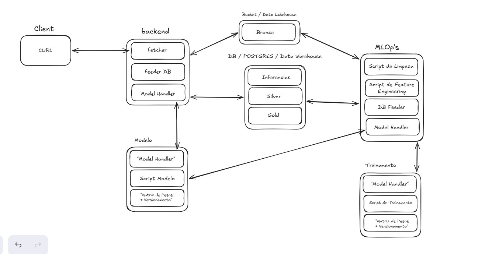
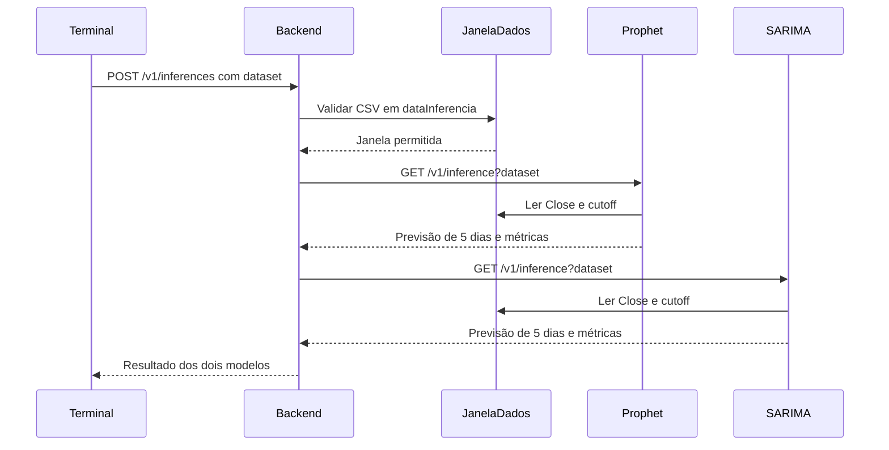
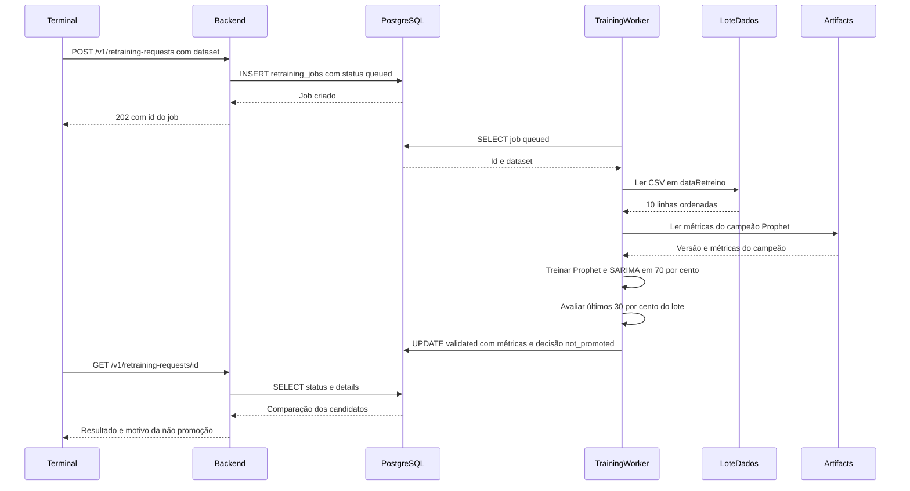

# Devlog — evidências visuais

Considerando o problema apresentado pela ponderada e a possibilidade de usar modelos de Gen AI para o desenvolvimento do código, aproveitei para aplicar conceitos de estudos próprios envolvendo sistemas agenticos. Então para o desenvolvimento da ponderada parti do pressuposto apresentado pelo artigo "The Reverse Information Paradox" que comenta sobre o fato do aumento de uso de Gen AI em empresas atuais e como isso impacta diretamente no tempo gasto em processo de planejamento e desenvolvimento de código, afinal até então se teve mais tempo gasto no processo de produção dos sistemas e menos tempo gasto no planejamento, o que impactava diretamente no valor agregado do produto, mas como a produção de código tem se tornado cada vez mais barata e rápida, essa inversão tende a ocorrer pensando em valor agregado. Então para o desenvolvimento da atividade eu gastei um tempo substancialmente grande em processos de planejamento e refinamento.

Meu workflow junto com Gen AI foi definido partindo de etapa de proposta(feita por mim), briefing(contraproposta do agente + Ajustes e definição de regras de neócio minhas), revisão (feita por mim), ajustes(feitas em conjunto), aplicação(feita quase que integralmente pelo assistente de código) e revisão final (feita integralmente por mim), sendo criado dois subagents para desenvolvimento do código e revisão do mesmo, além de ser aplicado uma política de economia de tokens e iteração de prompt, assim consegui um resultado substacnialmente interessante considerando eficiência e economia, afinal usei o modelo "Terra 5.5" para todas essas etapas. Esse Workflow é interessante por conseguir construir um sistema com qualidade, porém não me coloca como observador ou "desenvolvedor passivo" e sim aquele que define, planeja e utiliza da estrutura de "vetorização semântica" da ferramenta para aprender e fazer aplicações que sozinho não conseguiria pensar.

O dataset Escolhido foi o de cotação de USD/BRL do Yahoo Finance, como sugestão do professor. Como objetivo de predição escolhi que o modelo acertasse o valor vai subir ou descer e qual o valor previsto para a janela de 5 dias. 

A próxima etapa da atividade foi definir a arquitetura do projeto, escolhi aplicar a arquitetura medalhaão como política de qualidade de dados e separação entre dois bancos de dados, escolhi "MinLo" como sugestão do modelo de generativo para o Data Lake, com dados de qualidade bronze que é justamentee o ".csv" do dataset escolhido. E um postgres para as etapas de silver, gold e tabela separada para ineferencia, entretanto só estão implementadas duas tabelas que é a de retreino e inferencia devido não ter sido pensado em fase de ingestão, já que a EDA, feature engineering e treinamento dos primeiros modelos foram feitas em um notebook separado para só então serem convertidas em scripts. O Backend é responsável por fazer contato nas chamadas de inferencia nos containers dos modelos e o MLOps cuida da parte de repassar os dados selecionados para o container de retreino, apesar de que seria usado também de fazer a limpeza dos dados e feature engineering e repassar para silver e gold respectivamente, como não foi operacionalizada fase de ingestão devido ao tempo, essa função não foi aplicada, ficando apenas respon´savel em fazer o repasse para o container de retreino. Segue o fluxograma pensando inicialmente:

Para manter a ideia inicial do fluxograma o backend, Dados bronze, Banco relacional, MLOp's, Retreino e modelos ficaram em containers próprios com dockerfile próprios. Para depois "serem unidos", ou seja se comunicarem numa mesma "rede", através da declaração no "compose.yaml", em que temos a declaração dos services e o build deles, ou seja multistage build. A maioria das imagens utilizadas foi o python 3.12-slim , sendo as únicas diferentes as dedicadas para os containers de banco de dados , sendo o postgres:16-alpine para a camada de bronze o "bitnamilegacy/minio:2025.7.23" por sugestão do modelo generativo.

Quanto aos modelos selecionados, resolvi testar o Prophet como sugestão do professor e o SARIMA devido as aulas do eixo de matmática da fauldade em que teve o modelo de ARIMA apresentado na última aula, entretanto como estamos analizando um tempo maior que dois anos o ARIMA não seria o suficiente por não considerar sazonalidade. As métricas escolhidas foram MAE, para saber o erro absoluto médio dos modelos e como métrica de eleição na fase de retreino e Acurácia direcional (sugestão do modelo generativo) no quesito se o preço caiu ou subiu no processo. Para treino resolvi usar a técnica de backtesting, que apesar de parecer que foi sugestão do modelo generativo, na verdade foi devido ao fato dessa prática ser utilizada em modelos financeiros em que há a necessidade de um reajuste frequente dos modelos de predição devido a questões externas de apenas analisar os gráficos de ações não sendo apenas por efeito de sazonalidade.

Segue o diagrama UML de Sequencia aplicado na operação:

Para o Client, por sugestão do professor em utilizar o Curl, gerei uma CLI com o modelo generativo, em que é possível puxar status, ver resultados de predições passada, realizar inferencias e realizar retreino.
 
Para as simulações de inferencia e retreino, considerei quebrar o dataset bruto em 70% para treino e 30% para validação, considerando estpaço temporal em cada etapa de treino do backtesting, afinal se houver "data Leakage" nesta etapa muda completamnete o resultado do modelo. Para as inferencias e rereino permitidas pelo terminal, foi quebrado um pedaço extremamente pequeno do dataset para realizar as inferencias e retreino, onde deixei esses pedaços do dataset na pasta Data, apenas para simulaçção e demonstração do funcionamento do sistema, já que a etapa de ingestão não foi implementada, segue as fotos de comprovação de interação com a CLI.

