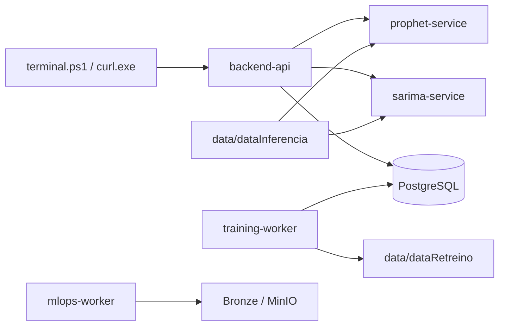
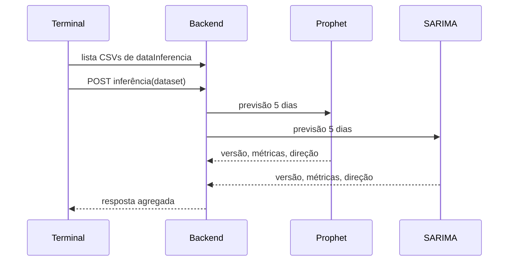

# Diagramas

## Arquitetura

## Inferência

## Prophet

O serviço Prophet carrega o artefato versionado treinado no histórico cronológico. Para cada CSV escolhido, usa o último `Close` como referência e prevê o fechamento no fim dos cinco dias úteis seguintes. A direção é `alta`, `queda` ou `estável` comparando esse fechamento previsto à referência. As métricas retornadas vêm do backtesting do artefato, nunca do CSV de inferência.
